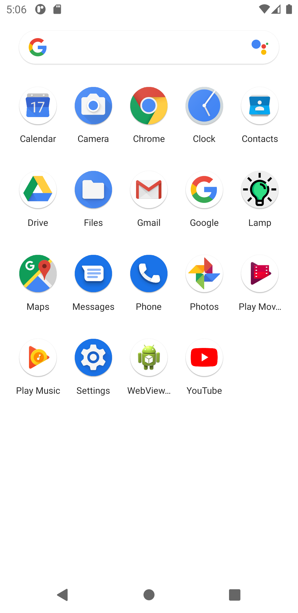
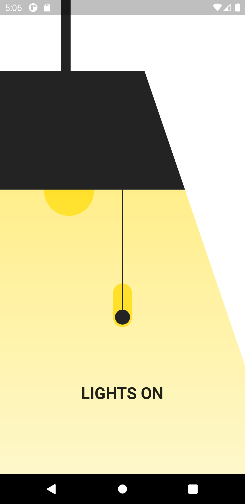
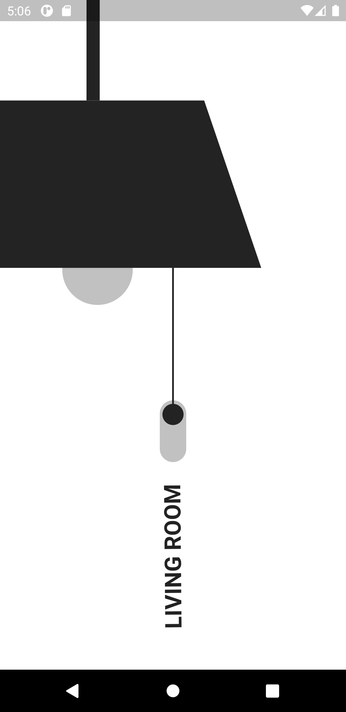

# Living Room Lamp
A smart living room lamp UI.

## Getting Started

This project is done in Flutter.
The lamp, switch and all the design and elements are designed in flutter.
No images is used in making UI of the application.

### Assets Used

The application used a free icon from FlatIcon.
The Icon asset is used to create the application icon.
#### ScreenShots

 

#### Download Apk

